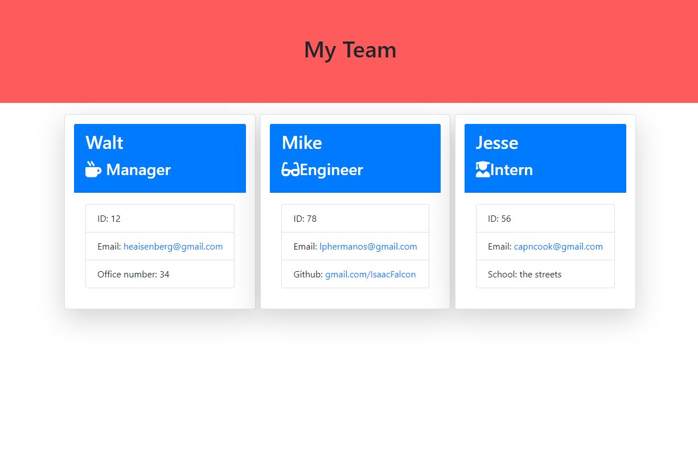

# TeamProfileGenerator

## Description

-A Generator created in node with JavaScript to help easily create an HTMl with all team members represented with an info card based on Manager, Intern, and Engineer.

## Description
- A command-line application that accepts user input
- I am prompted for information about my team manager name, id, email, and room number.
- once entered you are given choices to pick manager, intern, engineer, and none.
- intern will prompt questions for name, id, email and school.
- Engineer will prompt questions for name, id, email and Github.
- Can be filled out as many times as needed for team.
- Once none is pressed an HTML is generated for each member of the team.

## Table of Contents

- [Usage](#usage)
- [Credits](#credits)
- [License](#license)

## Usage

Instructions:
- download through this github.
- inquirer must be installed if not already.
- file system module needed.
- Jest is needed to run tests. (npm run test)
- Open up terminal.
- Make sure you are in folder with index.js.
- type node index.js
- answer prompted questions.
- On success an HTML will be generated in the dist folder.

Link to Video:

## Credits

Node.js
Bootstrap

## License

MIT License

Copyright (c) [2022] [Isaac Falcon]

Permission is hereby granted, free of charge, to any person obtaining a copy
of this software and associated documentation files (the "Software"), to deal
in the Software without restriction, including without limitation the rights
to use, copy, modify, merge, publish, distribute, sublicense, and/or sell
copies of the Software, and to permit persons to whom the Software is
furnished to do so, subject to the following conditions:

The above copyright notice and this permission notice shall be included in all
copies or substantial portions of the Software.

THE SOFTWARE IS PROVIDED "AS IS", WITHOUT WARRANTY OF ANY KIND, EXPRESS OR
IMPLIED, INCLUDING BUT NOT LIMITED TO THE WARRANTIES OF MERCHANTABILITY,
FITNESS FOR A PARTICULAR PURPOSE AND NONINFRINGEMENT. IN NO EVENT SHALL THE
AUTHORS OR COPYRIGHT HOLDERS BE LIABLE FOR ANY CLAIM, DAMAGES OR OTHER
LIABILITY, WHETHER IN AN ACTION OF CONTRACT, TORT OR OTHERWISE, ARISING FROM,
OUT OF OR IN CONNECTION WITH THE SOFTWARE OR THE USE OR OTHER DEALINGS IN THE
SOFTWARE.

---

## Badges

